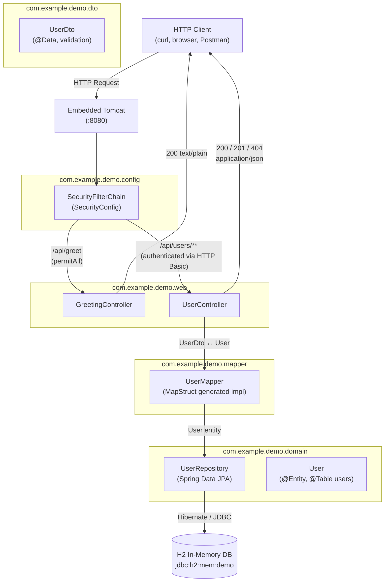
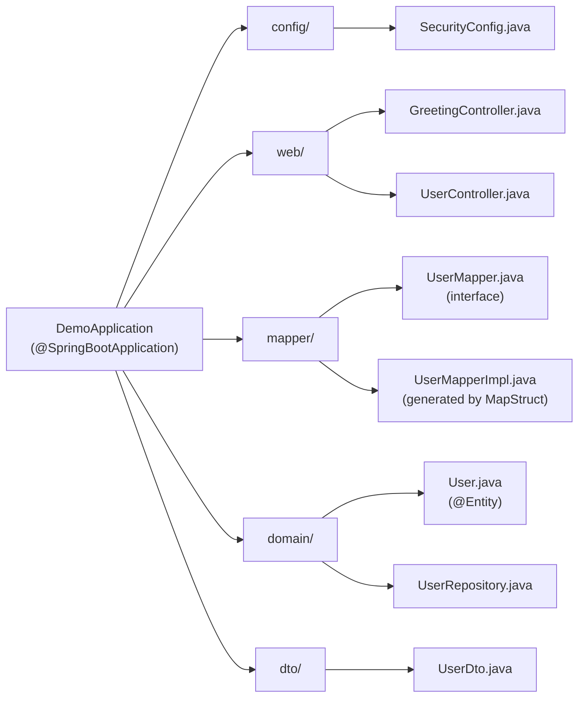
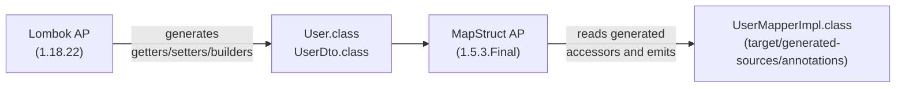

# Architecture Diagrams

This page is the canonical architectural reference for the `java-upgrade-demo` project. It complements the per-layer pages (Web Layer, Domain Layer, DTO & Mapper Layer, Security Configuration) with three end-to-end diagrams: the **request flow**, the **package structure**, and the **compile-time code generation pipeline**.

All diagrams reflect the `main` branch baseline: Java 11 + Spring Boot 2.7.18.

---

## 1. Request Flow

The following diagram traces a single HTTP request from the client through the embedded Tomcat, the Spring Security filter chain, the controllers, the mapper/repository layer, and finally the H2 in-memory database.



### What happens step by step

1. **Tomcat** receives the HTTP request on port `8080` (configured in `src/main/resources/application.yml` line 15).
2. The **Spring Security filter chain** built by `SecurityConfig` (`src/main/java/com/example/demo/config/SecurityConfig.java` lines 10-21) inspects the request:
   - `GET /api/greet` matches `antMatchers("/api/greet").permitAll()` on line 17 and is allowed through anonymously.
   - Everything else hits `anyRequest().authenticated()` (line 18) and is challenged via `httpBasic()` (line 20). CSRF is globally disabled on line 15.
3. For `/api/greet`, **`GreetingController`** (`src/main/java/com/example/demo/web/GreetingController.java` lines 11-14) returns a plain-text greeting that includes the request URL.
4. For `/api/users/**`, **`UserController`** (`src/main/java/com/example/demo/web/UserController.java` lines 20-47) handles CRUD:
   - On `GET /api/users` and `GET /api/users/{id}` the controller reads from `UserRepository` and uses **`UserMapper`** (`src/main/java/com/example/demo/mapper/UserMapper.java` lines 10-19) to translate `User` entities into `UserDto` responses.
   - On `POST /api/users` the controller validates the `UserDto` via `@Valid` (line 42), maps it back to a `User` entity with `mapper.toEntity(dto)` (line 43), persists it through `repository.save(...)`, and returns the new resource with a `Location` header.
5. **`UserRepository`** (`src/main/java/com/example/demo/domain/UserRepository.java` lines 3-6) is a Spring Data JPA interface — Spring generates its implementation at runtime and delegates to Hibernate, which talks to H2 over JDBC.
6. **H2** runs in-memory (`jdbc:h2:mem:demo;DB_CLOSE_DELAY=-1`, `application.yml` line 3) and the schema is auto-generated by Hibernate from `User` (`application.yml` line 8, `spring.jpa.hibernate.ddl-auto: update`).

### Sources

- `src/main/java/com/example/demo/config/SecurityConfig.java` lines 10-21
- `src/main/java/com/example/demo/web/GreetingController.java` lines 11-14
- `src/main/java/com/example/demo/web/UserController.java` lines 20-47
- `src/main/java/com/example/demo/mapper/UserMapper.java` lines 10-19
- `src/main/java/com/example/demo/domain/UserRepository.java` lines 3-6
- `src/main/java/com/example/demo/domain/User.java` lines 21-54
- `src/main/resources/application.yml` lines 1-15

---

## 2. Package Structure

The application is split into five packages under `com.example.demo`, bootstrapped by a single `@SpringBootApplication` class.



### Responsibilities per package

| Package | Responsibility | Key file(s) |
| :--- | :--- | :--- |
| `com.example.demo` | App entry point. `@SpringBootApplication` triggers component scan for all sub-packages. | `DemoApplication.java` lines 1-12 |
| `com.example.demo.config` | Cross-cutting configuration beans. Currently only Spring Security. | `SecurityConfig.java` lines 1-22 |
| `com.example.demo.web` | HTTP-facing layer: REST controllers. No business logic. | `GreetingController.java` lines 1-15, `UserController.java` lines 1-47 |
| `com.example.demo.mapper` | DTO ↔ entity translation using MapStruct. The `Impl` is generated at compile time by the annotation processor. | `UserMapper.java` lines 1-19 (generated `UserMapperImpl` lives under `target/generated-sources/annotations/`) |
| `com.example.demo.domain` | JPA entity + repository. Owns the persistence boundary. | `User.java` lines 1-55, `UserRepository.java` lines 1-6 |
| `com.example.demo.dto` | API contract — validated Data Transfer Object. No JPA annotations. | `UserDto.java` lines 1-27 |

### Why this split matters for the upgrade

- The `config/`, `domain/`, `dto/`, and `web/` packages all import `javax.persistence`, `javax.validation`, and `javax.servlet` on Java 11 / Spring Boot 2.7. The Spring Boot 3 upgrade moves every one of these to `jakarta.*`. Having them fenced inside their own packages makes the rewrite mechanical.
- `SecurityConfig` is the only class that extends a Spring Security base class (`WebSecurityConfigurerAdapter`), so the Spring Security 6 refactor is localized to `config/`.
- The mapper interface in `mapper/` is stable — only the generated implementation changes when annotation-processor versions change.

### Sources

- `src/main/java/com/example/demo/DemoApplication.java` lines 1-12
- `src/main/java/com/example/demo/config/SecurityConfig.java` lines 1-22
- `src/main/java/com/example/demo/web/GreetingController.java` lines 1-15
- `src/main/java/com/example/demo/web/UserController.java` lines 1-47
- `src/main/java/com/example/demo/mapper/UserMapper.java` lines 1-19
- `src/main/java/com/example/demo/domain/User.java` lines 1-55
- `src/main/java/com/example/demo/domain/UserRepository.java` lines 1-6
- `src/main/java/com/example/demo/dto/UserDto.java` lines 1-27

---

## 3. Compile-Time Code Generation

Two annotation processors run **in a specific order** during `./mvnw compile`. Getting the order wrong silently breaks the build, so this diagram is worth memorising.



### Why the order matters

MapStruct generates the `UserMapperImpl` class by inspecting the public **getters and setters** of the source (`User`) and target (`UserDto`) types. Those accessors do not exist in the hand-written `.java` source — they are generated at compile time by Lombok from `@Getter`, `@Setter`, `@Data`, etc. If MapStruct runs before Lombok, it sees classes without accessors and emits an error such as:

```
No implementation was created for UserMapper due to having a problem in the erroneous element com.example.demo.domain.User. Hint: this often means that some other annotation processor failed.
```

The correct order is enforced by declaring `lombok` **first** and `mapstruct-processor` **second** inside `<annotationProcessorPaths>` in `pom.xml` lines 101-112. The Maven compiler plugin runs processors in the order they appear in that list.

```xml
<annotationProcessorPaths>
    <path>
        <groupId>org.projectlombok</groupId>
        <artifactId>lombok</artifactId>
        <version>${lombok.version}</version>
    </path>
    <path>
        <groupId>org.mapstruct</groupId>
        <artifactId>mapstruct-processor</artifactId>
        <version>${org.mapstruct.version}</version>
    </path>
</annotationProcessorPaths>
```

See the **Annotation Processing Deep Dive** page for version-compatibility notes (`lombok-mapstruct-binding`), what happens on newer Lombok versions, and why `<scope>provided</scope>` on the Lombok dependency is not enough by itself.

### Sources

- `pom.xml` lines 95-114 (maven-compiler-plugin configuration)
- `pom.xml` lines 101-112 (annotationProcessorPaths — Lombok before MapStruct)
- `pom.xml` lines 25-26 (`org.mapstruct.version`, `lombok.version`)
- `pom.xml` lines 52-62 (Lombok and MapStruct runtime dependencies)
- `src/main/java/com/example/demo/domain/User.java` lines 3-8 (Lombok annotations)
- `src/main/java/com/example/demo/dto/UserDto.java` lines 3-6 (Lombok annotations)
- `src/main/java/com/example/demo/mapper/UserMapper.java` lines 10-19 (MapStruct interface)
